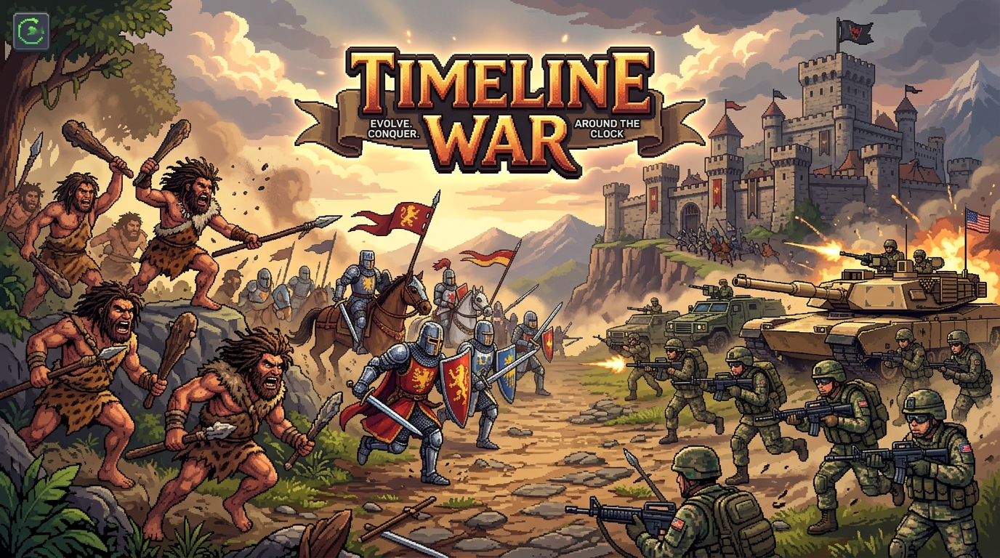
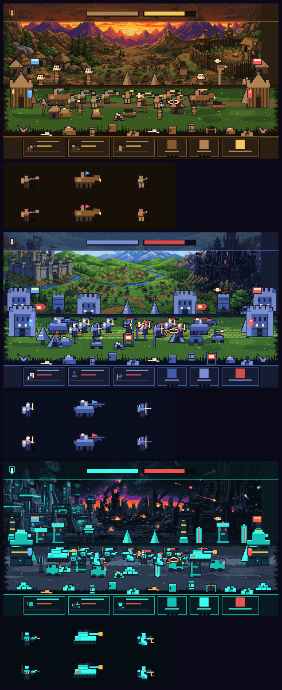
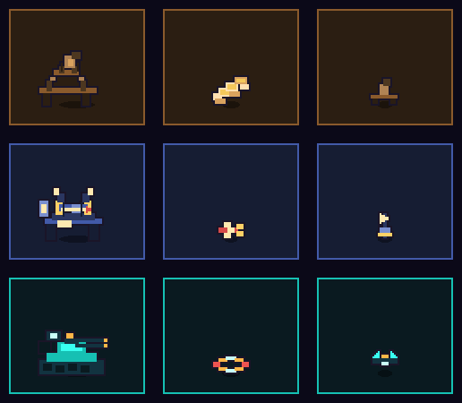

# ⚔️ Timeline War

[](https://github.com/garouthehumanmonster/git_test/actions/workflows/ci.yml)
[](LICENSE)

A lightweight, single-lane RTS played directly in your browser. March your army across the lane, evolve from the Stone Age to the Modern Age, and destroy the enemy tower before they destroy yours.



## Screenshots

Rendered by `npm run art:preview` from the same art code the game runs — no
browser required. Full-size per-age frames live in `docs/`.



The combat kit added with the campaign — base turrets, attack effects and the
turret/superweapon HUD icons, at the exact scale they appear in play:



## Highlights

- **Five-Stage Campaign**: *Dawn of Man → Iron Vanguard → Technological Divide → Blitzkrieg → Total Timeline War*, each with its own AI script. Wins are rated 1-3 stars on surviving base HP, and progress (unlocked stages, stars, best clear times) is saved to `localStorage`.
- **Orders Of Battle That Read**: units take a lane rank from their id (`(id % 5 - 2) * 12`), only three melee fighters per side may engage one target, and everyone queued behind them holds a 16-24px following distance. Armies fight as formations, never as one-pixel mosh pits.
- **Base Defence Turrets**: buy one from the HUD and upgrade it twice. Stone slingshot, Medieval ballista volley, Modern twin flak — each auto-targets the nearest enemy inside 250px of your tower.
- **Age Superweapons**: one ultimate meter per side, charged by time and by kills. Fire Meteor Strike, Rain of Fire or an Airstrike with `Space` or the HUD button.
- **A Lane That Actually Resolves**: numbers push the clash line forward, a breached front sieges the tower, and after four minutes the timeline collapses — draining both bases so a dead-even match still produces a winner.
- **Puppet Animation**: walk cycles (bob, lean, per-unit phase), lunge attacks with swing arcs, muzzle flashes and ground shocks, 60ms white hit flashes with micro knockback, and deaths that burst red, topple 90° and fade in 250ms. Health bars appear only when a unit is wounded or hovered.
- **Pure Deterministic Simulation**: Decoupled fixed-step tick loop (50ms) driven by a 32-bit Mulberry32 PRNG. Zero DOM or Phaser dependencies inside `src/sim/`. Netplay and replay ready.
- **Three Civilizations & Strict Counter Triangle**:
  - **Swarm** beats Ranged
  - **Ranged** beats Tank
  - **Tank** beats Swarm
- **Veterancy Progression**: Units gain kills on the field. Promoted units earn rank chevrons (+25%/+55% damage, +15%/+30% HP, +6% speed) and an instant HP top-up.
- **In-Age Upgrades**: Spend gold on the **Forge** (`U`, +15% DMG per rank) and **Armor** (`Y`, +15% HP per rank). 3 ranks per age. Multipliers stack multiplicatively with veterancy.
- **CrazyGames SDK v3 Integration**: Built-in `gameplayStart()`, `gameplayStop()`, `happytime()` triggers, interstitial midgame ads on match restart, and a `BONUS +100G` rewarded ad button.
- **Voice Announcer & Procedural Chiptune Audio**: Self-contained Web Audio chiptune sequencer (bass + lead + drums) + one-shot SFX + age-synced radio-filtered announcer voice with Web Speech API fallback. Press **M** to mute.
- **One Pixel Grid, Three Ages**: Every unit, tower, prop and projectile is generated at runtime in `src/render/` from a tiny pixel-primitive sprite language, then drawn at exactly 2x (one authored pixel = two canvas pixels). A shared ink colour (`#1a1528`) is dilated around every silhouette in code, so nothing ever looks like a floating cut-out.
- **Painted Backdrops, Graded On Palette**: The four age panoramas are real pixel art, pre-processed offline (`npm run art:build`) into 450x143 strips and posterised onto each age's landscape palette, so they sit behind the lane instead of washing it out.
- **Team Cloth**: Player and enemy units share one set of silhouettes and are separated by baked-in team colours plus heraldry on towers and flags.
- **Headless Bot Self-Play**: Run CI balance matches via `npm run sim`.

## Running

```bash
npm install
npm run dev        # launch the game on http://localhost:5173
npm test           # run the test suite (Vitest)
npm run typecheck  # tsc --noEmit
npm run build      # production build into dist/
npm run sim        # headless self-play match (pass a count, e.g. `npm run sim 100`)
npm run art:build  # regenerate public/atlas backdrops from art/source
npm run art:preview # software-render the scene to docs/*.png (no browser needed)
```

## Controls

| Key | Action | Description |
| :--- | :--- | :--- |
| `1` | **Spawn Swarm** | Clubber / Man-at-Arms / Commando (cheap, fast, shreds ranged) |
| `2` | **Spawn Tank** | Mammoth / Knight / Heavy Tank (beefy, slow, crushes swarms) |
| `3` | **Spawn Ranged** | Slinger / Archer / Sniper (fragile, long range, melts tanks) |
| `U` | **Forge Upgrade** | Increases army damage output by +15% per rank |
| `Y` | **Armor Upgrade** | Increases army health pool by +15% per rank |
| `E` | **Evolve Age** | Advances civilization (Stone → Medieval → Modern) |
| `T` | **Build / Upgrade Turret** | One base-defence turret, three ranks, auto-firing |
| `Space` | **Superweapon** | Fires the age's ultimate once the meter is full |
| `X` | **Cycle Speed** | Toggles 1× / 2× / 3× game speed |
| `Enter` | **Next Level** | Opens the next campaign stage on the results card |
| `P` / `Esc` | **Pause** | Pauses simulation and game clock |
| `M` | **Mute** | Toggles all music, SFX, and voice audio |
| `R` | **Restart** | Resets and restarts the match |

*All actions can also be triggered directly via the on-screen HUD buttons.*

---

## Architecture

```
src/
├─ main.ts                     # Phaser game bootstrap & CrazyGames init
├─ crazygames.ts               # CrazyGames SDK v3 wrapper (ads, lifecycle hooks)
├─ campaign.ts                 # Five stages, star rating, localStorage progress
├─ audio/
│  ├─ audio.ts                 # Web Audio chiptune sequencer + one-shot SFX
│  └─ voice.ts                 # Announcer voice system with Web Speech fallback
├─ sim/                        # Pure headless simulation (zero Phaser imports)
│  ├─ types.ts                 # Sim state types, unit defs, turrets, ultimates, match rules
│  ├─ rng.ts                   # Mulberry32 PRNG + rehydratable RNG wrapper
│  └─ sim.ts                   # Fixed-tick combat, engagement slots, turrets, AI
└─ render/
   ├─ BootScene.ts             # Preloads the graded backdrops
   ├─ MenuScene.ts             # Campaign map: stage cards, locks and stars
   ├─ GameScene.ts             # Render loop, puppet animation, juice, input
   ├─ Stage.ts                 # Backdrop + parallax props + lane terrain owner
   ├─ Hud.ts                   # Top strip, base bars, deploy/upgrade/evolve buttons
   ├─ palette.ts               # 8 colours per age, team cloth, landscape ramp
   ├─ spriteops.ts             # Pixel primitives, ink dilation, texture fitting
   ├─ unitart.ts               # Unit sprites for all ages and roles
   ├─ basearth.ts              # Tower sprites per age and side
   ├─ propart.ts               # Landscape props + the shared prop layout
   ├─ portraits.ts             # Compact HUD unit portraits
   ├─ turretart.ts             # Turret, attack-effect and HUD icon art
   ├─ laneart.ts               # Dithered lane terrain (pure code, no Phaser)
   ├─ gfx.ts                   # The tiny Graphics surface the art code targets
   └─ textures.ts              # Generates every runtime texture at boot
art/
├─ source/                     # Authoring input: the four age panoramas (JPEG)
└─ preview/                    # Ignored; rendered by `npm run art:preview`
public/
├─ atlas/                      # Graded, palette-locked age backdrops (generated)
├─ banner.jpg                  # 16:9 CrazyGames portal banner art
├─ icon.jpg                    # 1:1 game icon & favicon
└─ voice/                      # Announcer voice WAV audio callouts
docs/                          # Committed scene previews (see `npm run art:preview`)
test/                          # Vitest suite (sim logic, determinism, art contract)
scripts/
├─ sim-match.ts                # Headless bot-vs-bot runner
├─ build-backdrops.ts          # Offline art pipeline: grade + posterise panoramas
├─ render-preview.ts           # Software-renders the real scene to PNG
├─ lib/                        # PNG encoder + area resampler + software rasteriser
└─ gen_voice.ps1               # Voice synthesis script
.github/workflows/ci.yml       # Automated test, art-pipeline and build checks
LICENSE                        # MIT License
```

## Art Pipeline

All gameplay art is code, and all landscape art is pre-processed so it cannot
fight with the gameplay art:

```bash
npm run art:build     # art/source/*.jpg -> public/atlas/bg_<age>.png (committed)
npm run art:preview   # renders docs/scene_<age>.png, units_<age>.png + kit.png
```

`npm run art:build` crops each panorama to the sky band's aspect ratio,
resamples it to the game's texel grid, grades it (saturation, contrast, age
tint, vertical falloff), then posterises it onto that age's landscape ramp with
a light ordered dither. Because the output is palette-locked and committed, the
same PNG is served in every environment and CI fails if it drifts from the
source.

`npm run art:preview` renders the actual scene — backdrop, lane, props, towers,
a unit line-up and the HUD chrome — through a small software rasteriser that
implements the same `PixelGraphics` interface the game's art code targets. It
needs no browser and no GPU, which is how the visuals are reviewed in CI and
why `docs/scene_*.png` is committed.

The `test/render/art.test.ts` suite enforces the contract that keeps all of this
coherent: every sprite stays on that age's palette (plus team cloth), and every
opaque pixel that touches empty space must be the universal ink colour, which
proves the 1px outline survives the texture-fitting step.

`npm run art:preview` also writes `docs/kit.png`, a contact sheet of the combat
art (turrets, attack effects, HUD icons) at play scale.

## Simulation & Audio

The simulation is fully decoupled from rendering and deterministically
replayable from a seed (`state.rngState`). Every `tick(state, intents)` call
advances the world by `TICK_MS` (50ms) and mutates the state in place; the
Phaser scene simply drains the accumulator in its `update` callback and
interpolates the rendered positions.

The audio engine is similarly self-contained: `audio.init()` (must be called
after a user gesture to satisfy browser autoplay policies) spins up an
`AudioContext` with a master compressor, a music bus, and an SFX bus, then
starts a lookahead scheduler that sequences a chiptune loop live. SFX are one-
shot oscillator + filtered-noise patches; no audio files ship with the game.

## Campaign

`src/campaign.ts` owns the five stages and every progression rule; it is pure
TypeScript (no Phaser, no DOM) and unit-tested, which is why stage rules can be
fed straight into `createInitialState(seed, stage.rules)` in both the game and
the headless harness. Progress lives under one key:

```jsonc
// localStorage["timeline_war_campaign_v1"]
{ "unlocked": 3, "stars": { "1": 3, "2": 2 }, "bestMs": { "1": 74000, "2": 121500 } }
```

Star rating is purely defensive: **>80%** surviving base HP is 3★, **>40%** is
2★, and any win is at least 1★.

## Balance

Balance is tuned against the built-in bot (see `simulateBotMatch`). The
headless player bot mirrors the AI's composition, evolution, and upgrade
policy, so self-play is a useful smoke test rather than an unfair AI-vs-dummy
comparison. Results vary by seed; a typical 50-match run is close to even and
finishes without timeouts.

```bash
npm run sim 50
```

Use the output to spot regressions, then tweak the tables in
`src/sim/types.ts` to rebalance.

## Testing & Determinism

The game is strictly deterministic. The Mulberry32 PRNG state is preserved and rehydrated from `state.rngState` on every tick. The test suite includes:
1. **Unit & Transition Tests**: State initialization, economic gates, age transitions, and cooldown locks.
2. **Golden Replay Tests**: Replaying fixed intent sequences verifies byte-for-byte state alignment and hash equality across runs (`test/sim/determinism.test.ts`).
3. **Headless Bot Balance Tuning**: Automated bot matches report win/loss rates and timeouts to catch balance regressions (`npm run sim 50`).

## Assets

- **Banner & Icon:** 16:9 CrazyGames portal banner and 1:1 favicon / app icon.
- **Battlefield:** Painted per-age panoramas, pre-graded onto the age palette by `scripts/build-backdrops.ts` and shipped in `public/atlas/`; lane terrain, props and parallax are drawn procedurally.
- **Units, bases, flags, projectiles, particles, props, UI crests & icons:** Drawn procedurally at boot with Phaser Graphics from op lists in `src/render/*art*.ts`, on a strict 2x texel grid with an automatic 1px ink outline.
- **Audio:** Web Audio chiptune synthesizer (`src/audio/audio.ts`) + announcer voice callouts with Web Speech API fallback (`src/audio/voice.ts`).

## License

[MIT](LICENSE)

